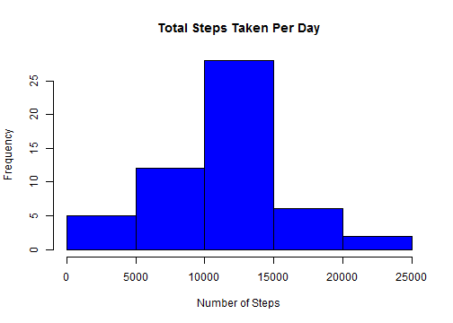
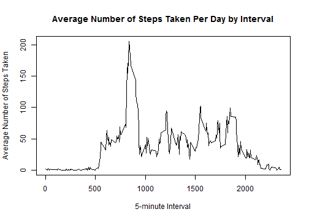
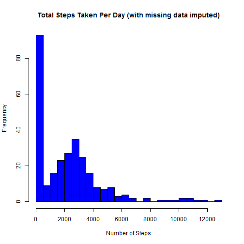
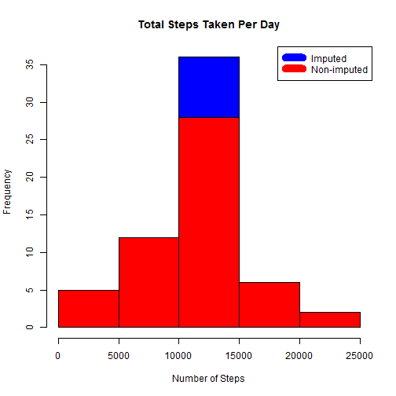
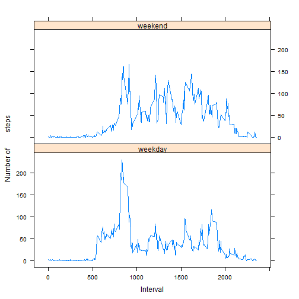

# About this file
This is the first Peer Assessment project for the course **Reproducible Research** in Coursera's Data Science specialization. This assignment helps us to practically demonstrate how to write R markdown document.

This assignment makes use of data from a personal activity monitoring device. This device collects data at 5 minute intervals through out the day. The data consists of two months of data from an anonymous individual collected during the months of October and November, 2012 and include the number of steps taken in 5 minute intervals each day.

# About the Data

The data for this assignment is downloaded from the course web site: https://d396qusza40orc.cloudfront.net/repdata%2Fdata%2Factivity.zip
        
The variables included in this dataset are:

1. Steps        : Number of steps taking in a 5 minute interval (missing values are coded as NA)
2. Date         : The date on which the measurement was taken in YYYYMMDD format
3. Interval     : Identifier for the 5 minute interval in which measurement was taken

The dataset is stored in a comma-separated-value (CSV) file and there are a total of 17,568 observations in this dataset.

# Loading and preprocessing the data

*The code downloads the zip file (if it does not already exist), extracts the csv file, reads it, and displays the head and dimensions of the data.*


```r
if(!file.exists("repdata_data_activity.zip")) {
        temp <- tempfile()
        download.file("http://d396qusza40orc.cloudfront.net/repdata%2Fdata%2Factivity.zip",temp)
        unzip(temp)
        unlink(temp)
        }
data <- read.csv("activity.csv",header=TRUE)
head(data)
```

```
##   steps       date interval
## 1    NA 2012-10-01        0
## 2    NA 2012-10-01        5
## 3    NA 2012-10-01       10
## 4    NA 2012-10-01       15
## 5    NA 2012-10-01       20
## 6    NA 2012-10-01       25
```

```r
dim(data)
```

```
## [1] 17568     3
```

# What is mean total number of steps taken per day?

*1. Calculate the total number of steps taken per day* 


```r
        total_steps_taken_per_day <- aggregate(steps ~ date, data, sum, na.rm=TRUE)
        mean_steps <- mean(total_steps_taken_per_day$steps)
        median_steps <- median(total_steps_taken_per_day$steps)

        ## Make a histogram of the total number of steps taken each day
        hist(total_steps_taken_per_day$steps, main = paste("Total Steps Taken Per Day"), col ="blue", xlab="Number of Steps")
```

 

**Total** number of steps taken per day is: 570608  
**Mean** of the total number of steps taken per day is: 10766  
**Median** of the total number of steps taken per day is: 10765

## What is the average daily activity pattern?


```r
        steps_by_5_min_interval <- aggregate(steps ~ interval, data, mean)
        plot(steps_by_5_min_interval$interval,steps_by_5_min_interval$steps, type="l", xlab="5-minute Interval", ylab="Average Number of Steps Taken",main="Average Number of Steps Taken Per Day by Interval")
```

 

```r
        max_5_min_interval <- steps_by_5_min_interval[which.max(steps_by_5_min_interval$steps),1]
```
The 5-minute interval, on average across all the days in the dataset, that contains the maximum number of steps is 835.

## Imputing missing values

*There are a number of missing values in the dataset. This is likely to introduce bias in the
calculation. The code will fill the missing values, create a new dataset with complete values,
and calculate the new mean and median of the total number of steps taken per day. This will be 
represented by a histogram.  

If a 5-minute interval on a particular date has missing value, we use the mean for that date.*


```r
        # Calculate number of missing values
        incomplete_cases <- sum(!complete.cases(data))
```

The total number of missing values in the dataset is: 2304.


```r
        # Create new data frame loaded with original base data for imputation
        impute_data <- data
        
        # Extract the missing data from impute_data dataframe
        missing_data <- is.na(impute_data$steps)
        
        # Impute missing steps with mean steps for that 5-minute interval
        int_avg <- tapply(data$steps, data$interval, mean, na.rm=TRUE, simplify=T)
        impute_data$steps[missing_data] <- int_avg[as.character(impute_data$interval[missing_data])]

        # Calculate total number of steps taken each day
        new_dailysum <- tapply(impute_data$steps, impute_data$interval, sum, na.rm=TRUE, simplify=T)
        
        # Draw histogram of the total number of steps with missing values imputed
        hist(x=new_dailysum,col="blue",breaks=20,xlab="Number of Steps",ylab="Frequency",main="Total Steps Taken Per Day (with missing data imputed)")
```

 

```r
        # Recount total steps by day and create Histogram. 

        steps_by_day_i <- aggregate(steps ~ date, impute_data, sum)

        # Show difference using histogram
        hist(steps_by_day_i$steps, main = paste("Total Steps Taken Per Day"), col="blue", xlab="Number of Steps")
        hist(total_steps_taken_per_day$steps, main = paste("Total Steps Taken Per Day"), col ="red", xlab="Number of Steps", add=T)
        legend("topright", c("Imputed", "Non-imputed"), col=c("blue", "red"), lwd=10)
```

 

```r
        # Summarize the total and difference

        new_mean <- mean(steps_by_day_i$steps)
        new_median <- median(steps_by_day_i$steps)

        mean_diff <- new_mean - mean_steps
        med_diff <- new_median - median_steps

        total_diff <- sum(steps_by_day_i$steps) - sum(total_steps_taken_per_day$steps)
```

* The imputed data mean is: 10766
* The imputed data median is: 10766
* The difference between the non-imputed mean and imputed mean is: 0
* The difference between the non-imputed mean and imputed mean is: 1
* The difference between total number of steps between imputed and non-imputed data is 86130. Thus, there were 86130 more steps in the imputed data.

## Are there differences in activity patterns between weekdays and weekends?


```r
        # helper function to decide if a day is a weekday or not
        is_weekday <- function(d) {
                wd <- weekdays(d)
                ifelse (wd == "Saturday" | wd == "Sunday", "weekend", "weekday")
        }

        wx <- sapply(as.Date(impute_data$date), is_weekday)
        impute_data$wk <- as.factor(wx)
        head(impute_data)
```

      steps       date interval      wk
1 1.7169811 2012-10-01        0 weekday
2 0.3396226 2012-10-01        5 weekday
3 0.1320755 2012-10-01       10 weekday
4 0.1509434 2012-10-01       15 weekday
5 0.0754717 2012-10-01       20 weekday
6 2.0943396 2012-10-01       25 weekday

```r
        wk_df <- aggregate(steps ~ wk+interval, data=impute_data, FUN=mean)

        library(lattice)
        xyplot(steps ~ interval | factor(wk), layout = c(1, 2), xlab="Interval", ylab="Number of         steps", type="l", lty=1, data=wk_df)  
```

 

*From the panel plot it looks like the weekday activities arise earlier than the weekends weekday
activities arise around 5~6am and weekend activities arise around 8am. We can
also observe that from 10am to 5pm, the weekends have higher activity levels than the
weekdays.*


